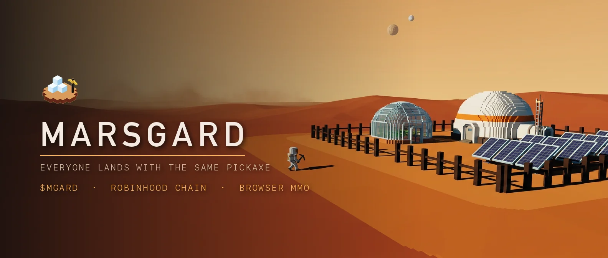
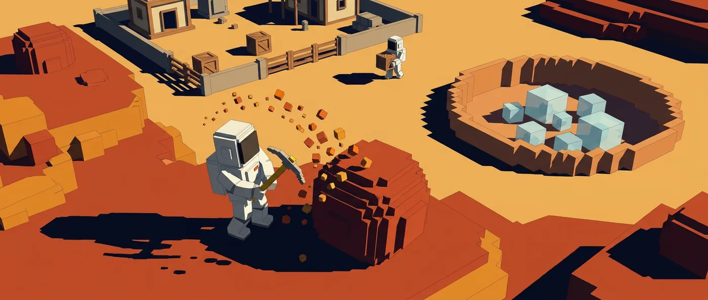
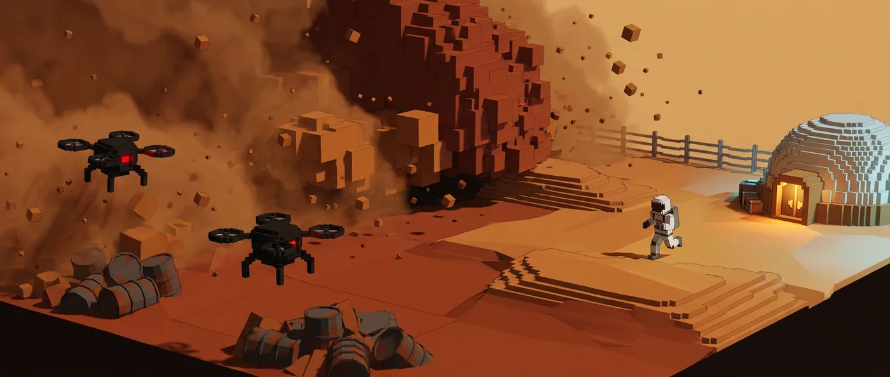
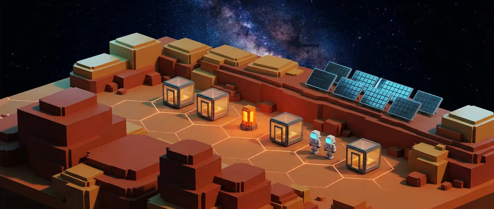
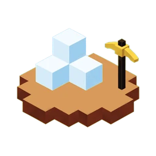

<div align="center">



<br>

# MARSGARD

**Everyone lands with the same pickaxe.**

A survival MMO on Mars that runs in your browser. Mine regolith and ice, sell at the Depot,
craft a hab, and decide whether you are brave enough for the Dunes. No download, no launcher.

<br>

[](https://play.marsgard.world)
[](https://marsgard.world)
[](https://marsgard.world/docs)

[](https://x.com/marsgard)
[](https://robinhoodchain.blockscout.com)
[](#token-at-a-glance)
[](https://www.typescriptlang.org)
[](https://threejs.org)

</div>

---

## What is Marsgard

You land on Mars with one pickaxe, two oxygen canisters and ten credits. Everyone does.
From there you mine regolith in the west field and ice in the east crater, sell it at the
Ares Depot, buy better tools, and push south into the Dunes where the scrap is and the
rogue mining drones are.

Free play runs to total level 10 with nothing locked behind a balance check. Holding
10,000 `$MGARD` lifts the cap and opens the wilderness. The token buys access. It never
buys power.

**What makes it different**

- **Isometric voxel 3D in a browser tab.** Real terrain from an analytic heightfield, day and night, dust storms, 60 fps on a laptop and playable on a phone.
- **The token sits at the economy's border.** Everyday currency is off-chain credits that can never be withdrawn. `$MGARD` touches four places only: the gate, the player market, the Supply Drop, and land.
- **Loss is a mechanic.** Die in the Dunes and your cargo drops into a suit wreck with a five-minute timer, marked on your map.
- **Server-authoritative from the first commit.** Anything carrying value or randomness runs on the server. The client is a window, never a referee.
- **No classes.** Five skills level from whatever you actually swing at. Tools and zones decide what you become.

---

## The Loop



```
┌──────────────────────────────────────────────────────────────────────────┐
│                    ONE SOL AT ARES OUTPOST · 8 REAL MINUTES              │
│                                                                          │
│   LAND ──▶ GATHER ──▶ SELL ──▶ BUY & CRAFT ──▶ PUSH OUT ──▶ CLAIM       │
│    │         │          │           │              │           │         │
│  wallet   regolith    Depot      pickaxe 40      the Dunes   the Ridge   │
│  sign-in    ice      terminal    wrench  80       scrap       Hab Pod    │
│  1 sig    silicate   48-slot     drill  260       drones      respawn    │
│           scrap       bank       O₂ can  25       storms      + locker   │
│           potato                 patch   30                              │
│                                                                          │
│   Every node has 3 hits, then depletes and respawns on a timer.          │
│   Each hit gives loot, skill XP and particles.                           │
└──────────────────────────────────────────────────────────────────────────┘
```

**Depot prices are fixed and identical for everyone**

| Sell | cr | | Buy | cr |
|---|---:|---|---|---:|
| Regolith | 1 | | Pickaxe | 40 |
| Ice block | 3 | | Water tank | 50 |
| Scrap | 4 | | Hoe | 60 |
| Potato | 5 | | Wrench | 80 |
| Silicate | 7 | | Power drill | 260 |

---

## Survival



Air is the clock. Every trip out is a decision with a walk-back time attached.

| System | Behaviour |
|---|---|
| **O₂ inside the fence** | Refills at +4/s |
| **O₂ in Field / Crater / Ridge** | Drains 0.45 to 0.55/s |
| **O₂ in the Dunes** | Drains 0.9/s, and 50% faster while a storm holds |
| **At 0 O₂** | The suit itself starts failing at 5 hp/s |
| **Drones** | 30 hp, hit for 5 every 1.4 s once within 2 m |
| **Safe-zone death** | Keep everything, respawn at the Outpost |
| **Dunes death, free** | Resources lost, tools kept |
| **Dunes death, holder** | Cargo drops in a wreck, 5 min timer, marked on map and compass |

**The sol.** One Martian day is eight real minutes. Sunrise at 06:00 refills the Outpost,
the first storm window opens at 09:00, the storm itself hits at 14:00 for 90 seconds, and
the next sunrise resets dailies, restores the free Supply Drop spin, reschedules the storm
and refreezes the ice.

---

## The Ridge



Craft a Hab Pod kit from 300 regolith, 90 scrap and 30 silicate, carry it north, and place
it. That is your respawn point and your locker, and the seed of a colony. Guilds pool scrap
into a shared bank, claim adjacent plots, and put a named colony on a map every other player
walks past. An unmaintained pod decays and the plot is released after 14 sols, so nobody
squats land they stopped playing on.

---

## Token at a Glance

`$MGARD` is a key and a fee unit. There are no emissions, no staking rewards and no yield.

| | |
|---|---|
| **Supply** | 1,000,000,000 |
| **Chain** | Robinhood Chain (EVM, chainId 4663) |
| **Launch** | Robinhood Chain launchpad, 100% fair launch |
| **Team allocation at launch** | 0%. The team buys on the open market and discloses it |
| **Presale** | None |
| **Timing** | After the multiplayer server is public |
| **Gate** | Fixed 10,000, which is 0.001% of supply |

**Access tiers**

| Tier | Held | Unlocks |
|---|---:|---|
| **Free** | 0 | Safe zones, Depot, 48-slot bank, quests, dailies, free daily spin. Level cap 10. Progress kept forever |
| **Holder** | 10,000 | Cap lifted, the Dunes, wreck drops, paid spins. After 24 h: market, guild bank, plots |
| **Founder** | 50,000 | Name on the in-world founders wall, 48 h early access to new realms, helmet decal |
| **Council** | 250,000 | Vote on the next realm, the storm calendar and plot releases |

**Five utilities, four of them sinks**

| Utility | Mechanic | Flow |
|---|---|---|
| Gate | Hold 10,000 to play past the fence | Demand |
| Supply Drop | $3 of `$MGARD` per paid spin at live price | 50% burned |
| Market | Credits ↔ `$MGARD`. Item-for-credits listings pay 0% | 5% fee |
| Ridge plots | 1,024 plots priced in `$MGARD` | 100% burned |
| Cosmetics | Suit colours, helmet decals, colony names | 100% burned |

> The token never changes yield, damage, drop rates or Depot prices. A holder and a free
> player swinging the same pickaxe get the same regolith. Access is the product.

---

## Architecture

```
┌─────────────────────────────────────────────────────────────────┐
│  BROWSER CLIENT            Vite · TypeScript · three.js         │
│  Isometric voxel renderer, analytic heightfield terrain,        │
│  instanced rocks, HUD, minimap, touch controls.                 │
│  Sends INTENTS only: move target, node id, buy, sell, equip.    │
└───────────────────────────┬─────────────────────────────────────┘
                            │  WebSocket, binary deltas, 10 ticks/s
┌───────────────────────────▼─────────────────────────────────────┐
│  GAME SERVER               Node, one process per realm shard    │
│  Authoritative world: node hp, respawn timers, drones, storms,  │
│  O₂ and suit drain, loot rolls, XP, credits ledger, escrow.     │
│  Validates every intent: range, tool, cooldown, cargo space.    │
└───────────────────────────┬─────────────────────────────────────┘
                            │
┌───────────────────────────▼─────────────────────────────────────┐
│  PERSISTENCE               Managed Postgres, row-level security │
│  colonists · inventories · banks · wrecks · plots · guilds ·    │
│  listings · append-only credits ledger                          │
└───────────────────────────┬─────────────────────────────────────┘
                            │
┌───────────────────────────▼─────────────────────────────────────┐
│  CHAIN                     Robinhood Chain, EVM                 │
│  Wallet sign-in by message signature · gate balance checks ·    │
│  market settlement verified by tx hash · plot registry          │
│  No custody contracts, no staking, no vaults.                   │
└─────────────────────────────────────────────────────────────────┘
```

**Where the server stands today.** For signed-in colonists the shard is the referee: node hp
and respawn, loot rolls, XP, credits, cargo, the bank, Depot trades, recipes, placement, quest
rewards and wrecks all resolve on the server from its own copy of the client's numbers, and the
client renders the answer. Still client-side, and the next to move: movement integration, O₂
and suit drain, drone AI. Anonymous colonists keep the solo simulation in their browser and are
refereed for nothing, which is why the card pages still say what they say.

**Anti-cheat, in short.** Movement is integrated server side at the colonist's real speed
and teleports are rejected rather than corrected. Interacts require distance under 2.8 m,
the correct tool in cargo and a per-node cooldown. Rate limits sit at one intent per 100 ms
and three harvests per four seconds. Nodes are global, so two colonists cannot both deplete
the same rock. The free tier cannot sell to other players, which means botted credits have
nowhere to go. Supply Drop RNG runs server side with a per-sol seed hash published before
the sol and revealed after it.

---

## Repository Layout

| Path | Contents |
|---|---|
| [`game/`](game) | The playable client. Vite + TypeScript + three.js, five zones, 38 nodes, Depot, bank, crafting, quests, skills, maps, mobile controls |
| [`web/`](web) | Landing page, the colonist guide, and public colonist cards at `/c/{name}` with generated share images. Next.js + Tailwind, live three.js diorama built from the game's own GLB assets |
| [`server/`](server) | The presence service. WebSocket shards that broadcast where every colonist is, wallet sign-in with server-side saves, world chat, plus the read-only card API the website reads. Node + `ws` + `viem`, non-root container |
| [`viewer/`](viewer) | Model inspector for the voxel assets and animation clips |
| [`assets/`](assets) | Headless Blender source scripts and the exported GLB set (colonist, gear, tools, props) |
| [`brand/`](brand) | Logo, mark, favicon and OG card |
| [`brand-gen/`](brand-gen) | The art generation pipeline used to produce the world plates |

---

## Quick Start

Requires Node 22+ and pnpm 10+.

```bash
git clone https://github.com/marsgard/marsgard.git
cd marsgard

# the game client, on http://localhost:5208
cd game && pnpm install && pnpm dev

# the landing page and docs, on http://localhost:3000
cd ../web && pnpm install && pnpm dev

# the presence service, on ws://localhost:8790 — optional; the game runs solo without it
cd ../server && pnpm install && pnpm dev
```

To see other colonists, open the game with `?presence=ws://localhost:8790` in a second tab.
To render colonist cards locally, start the website with `PRESENCE_URL=http://localhost:8790`.

`pnpm build` in either directory produces a production build. The game emits a static
`dist/`. The landing page emits a standalone Next.js server under `.next/standalone`.

---

## Tech Stack

| Layer | Choice | Why |
|---|---|---|
| Renderer | three.js r180 | Instanced voxel world at 60 fps on a laptop, playable on a phone |
| Client build | Vite 7 + TypeScript 5 | Fast iteration, `three` split into its own cached chunk |
| Terrain | Analytic heightfield | One function drives the mesh, the collision and the baked map, so the map metre is the walked metre |
| Landing page | Next.js 16 + React 19 + Tailwind 4 | Standalone output, static WebP art, immutable asset headers |
| Server | Node + `ws`, shards inside one process | Presence today at 6 ticks/s; authoritative world state lands here in Phase 1's second half |
| Persistence | Managed Postgres with row-level security | Append-only ledger for credits and settled trades |
| Chain | Robinhood Chain (EVM) | Standard ERC-20, one small plot registry, nothing held on-chain for users |

---

## Roadmap

| Phase | When | Scope |
|---|---|---|
| **0. Playable slice** | Done | Voxel colonist and gear, Mars terrain and sky, sol cycle, storms, drones, five zones, 38 nodes, Depot, bank, crafting, building, wrecks, quest chain, dailies, skills, maps, HUD, mobile |
| **1. Multiplayer** | Weeks 1 to 6 | Shipped: presence shards, other colonists in the world and on the map, colonist cards at `/c/{name}`, wallet sign-in with server-side saves, world chat, the referee for signed-in colonists (nodes, loot, credits, cargo, trades, crafting, quests, wrecks), landing page and docs. Next: server-integrated movement and O₂, closed beta with 100 colonists |
| **2. Token and economy** | Weeks 7 to 10 | Shipped: the gate (10,000 held, read from chain), the Supply Drop wheel with committed per-sol seeds and paid spins, the treasury page summed from chain events, the player market (credits for `$MGARD` with escrow, 24 h holding and dual-receipt settlement; items for credits at no fee). Paid spins wait for a live price |
| **3. The Dunes** | Months 3 to 4 | PvP outside the fence, wreck looting, arena with credit stakes, guilds and guild bank, storm seasons, founder wall, cosmetics |
| **4. The Ridge and beyond** | Months 5 to 12 | 1,024 plots and plot NFTs, colony names on the map, offline production with upkeep, Lava Tubes and Tharsis realms, Council votes |

Nothing in Phase 2 ships before Phase 1 holds 300 concurrent for seven straight sols.

---

## Official Links

| | |
|---|---|
| Website | [marsgard.world](https://marsgard.world) |
| Game | [play.marsgard.world](https://play.marsgard.world) |
| Colonist guide | [marsgard.world/docs](https://marsgard.world/docs) |
| X | [@marsgard](https://x.com/marsgard) |
| Explorer | [robinhoodchain.blockscout.com](https://robinhoodchain.blockscout.com) |

---

## ⚠️ Scam Warning

- There is **no presale**, **no whitelist** and **no allocation**. Anyone offering one is a scammer.
- The contract address will be published **only** on this repository, on [marsgard.world](https://marsgard.world), and on [@marsgard](https://x.com/marsgard). Verify it in all three places before you send anything.
- Nobody from the team will ever DM you first, ask for your seed phrase, or ask you to connect a wallet to a link sent in a direct message.
- Team allocation at launch is 0%. Any wallet claiming to be an official team allocation is not one.

---

## Contributing

The closed beta wants colonists who will break the server on purpose and say exactly how
they did it. Open an issue with reproduction steps, the zone you were in, and the sol
number from your HUD. Balance reports are as welcome as crashes: if a number feels wrong,
say which number and what you expected.

---

## License

MIT.

---

<div align="center">



<sub>
<b>$MGARD is a utility token that unlocks access inside the Marsgard game.</b><br>
It is not an investment, a security, or a claim on revenue. Holding it grants access, not returns.<br>
Credits are an in-game unit with no cash value and cannot be withdrawn. Supply Drop prizes are in-game items.<br>
Digital assets are volatile and may lose all value. Nothing here is financial advice.<br>
Play within your means and check your local laws before participating in any token activity.
</sub>

<br><br>

<sub><b>Marsgard</b> · Everyone lands with the same pickaxe.</sub>

</div>
